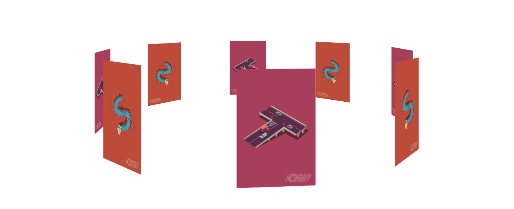

# BroadCast-3D
原生JS实现好玩的3D轮播图旋转特效。支持多参数注入。
唯一的不足点：由于开始写插件（轮子）吧，IE兼容性的做的不太好，后面会慢慢填补上这个坑。

**实例**：



## 依赖
原生JS实现，无需任何依赖
## 下载
```git
  https://github.com/hubvue/BroadCast-3D.git
```
或者点击上方 Clone or download
## 使用
```HTML
  <script src="BroadCast-3D/BroadCast.js"> </script>
```
## 实例
HTML文件
```HTML
  <div id="box"></div>
```
JavaScript文件
```javascript
  new Broadcast('#app', ["img/1.png","img/2.png","img/1.png","img/2.png","img/1.png","img/2.png","img/1.png", "img/2.png"],300,0.1);
```
或者
```javascript
  Broadcast('#app', ["img/1.png","img/2.png","img/1.png","img/2.png","img/1.png","img/2.png","img/1.png", "img/2.png"],300,0.1);
```
## API
  多参数注入
  
**第一个参数**
   第一个参数为盒子，所有的Img元素会自动生成为其子元素。可支持输入选择器或者Dom元素。例：
```HTML
  <div id="box"></div>
  <script>
    var box = document.getElementById("box");
    new Broadcast(box);
    //或者
    new Broadcast("#box");
  </script>
```

**第二个参数**

第二个参数为数组类型，是引用图片url地址的数组集合。
```javascript
  new Broadcast('#app', ["img/1.png","img/2.png","img/1.png","img/2.png","img/1.png","img/2.png","img/1.png", "img/2.png"]);
```  
**第三个参数**

可选，表示图片偏移半径。值为数字，默认值为250.
```javascript
  new Broadcast('#app', ["img/1.png","img/2.png","img/1.png","img/2.png","img/1.png","img/2.png","img/1.png", "img/2.png"],250);
```
    
**第四个参数**

可选，表示图片运动一次后所暂停的时间，值为数字（可为小数），以秒为单位，默认值为0
```javascript
  new Broadcast('#app', ["img/1.png","img/2.png","img/1.png","img/2.png","img/1.png","img/2.png","img/1.png", "img/2.png"],250,0);
``` 
## 类名
  当文件加载到项目顶端的时候，会产生一个名为Broadcast的全局类名。


